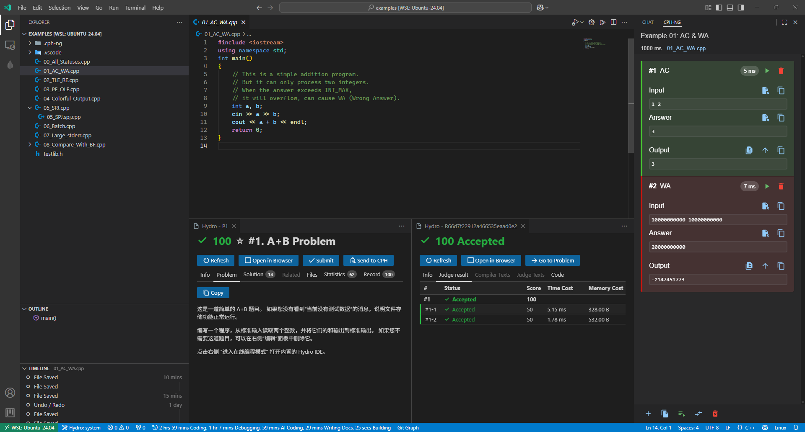
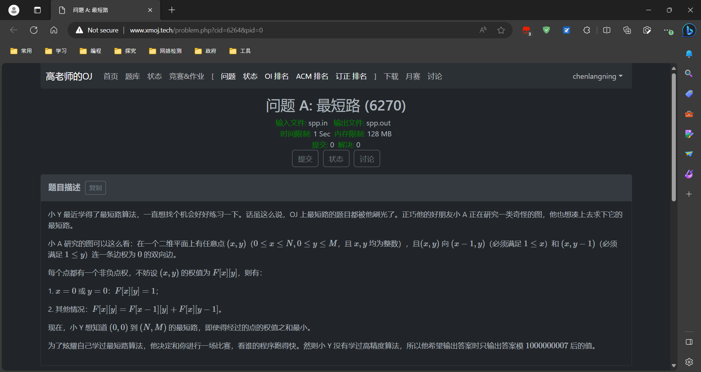

  

<h1 align="center">Langning Chen</h1>

  <strong>Grade 12 student, open-source developer, and competitive programmer in Shanghai</strong>

  
  
  
  

  
  

I build tools around real problems in competitive programming and developer workflows. My current focus is **CPH-NG**, alongside OI training, modern web systems, and a growing Rust practice.

## Selected work

<table>
  <tr>
    <td width="50%" valign="top">
      
      <h3>CPH-NG</h3>
      
A competitive-programming workflow for VS Code: sample retrieval, local judging, special judging, stress testing, and multi-platform submission.

      

        
        
      

      
<a href="https://github.com/langningchen/cph-ng">Source</a> | <a href="https://marketplace.visualstudio.com/items?itemName=langningchen.cph-ng">Visual Studio Marketplace</a>

    </td>
    <td width="50%" valign="top">
      
      <h3>XMOJ Script</h3>
      
A browser userscript that improves problem solving, discussions, and everyday use on XMOJ. Ongoing development lives in the XMOJ-Script-dev organization.

      

        
        
      

      
<a href="https://github.com/XMOJ-Script-dev/XMOJ-Script">Current repository</a> | <a href="https://github.com/langningchen/XMOJ-Script">Early personal version</a>

    </td>
  </tr>
</table>

### More projects

  
  
  
  

## Toolkit

  

  <strong>Languages</strong> 
  TypeScript | C++ | Rust | Python | JavaScript | C

  <strong>Product and infrastructure</strong> 
  Next.js | React | MUI | VS Code Extension API | Cloudflare Workers | GitHub Actions | Docker | pnpm

## Open-source collaboration

  &nbsp;&nbsp;
  &nbsp;&nbsp;
  &nbsp;&nbsp;
  &nbsp;&nbsp;
  

  Pull requests, fixes, feature proposals, and issue discussions across developer tools and open-source infrastructure.

## Competitive programming

<table>
  <thead>
    <tr>
      <th>Competition</th>
      <th>Result</th>
      <th>Score</th>
    </tr>
  </thead>
  <tbody>
    <tr><td>CSP-S 2025</td><td>First Prize</td><td>228 / 400</td></tr>
    <tr><td>NOIP 2025</td><td>Second Prize</td><td>118 / 400</td></tr>
    <tr><td>CSP-S 2024</td><td>Second Prize</td><td>160 / 400</td></tr>
    <tr><td>NOIP 2024</td><td>Third Prize</td><td>107 / 400</td></tr>
    <tr><td>CSP-S 2023</td><td>First Prize</td><td>175 / 400</td></tr>
  </tbody>
</table>

## GitHub activity

  

  <a href="https://www.langningchen.com"><strong>Explore the full portfolio</strong></a> 
  Project details, public activity, OI records, education, and game profiles.

